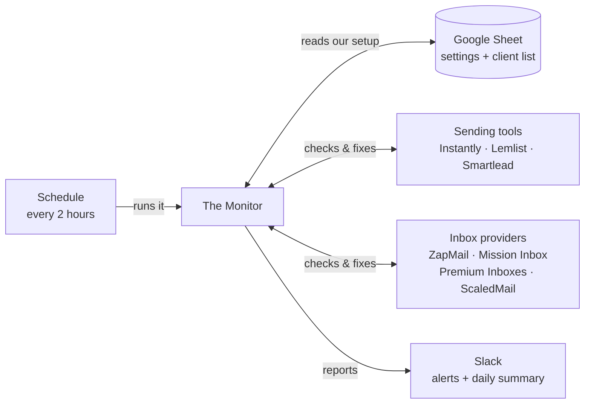

# Email Deliverability Monitor

A hands-off assistant that watches every sending mailbox for each client, fixes
the routine problems by itself, and tells us in Slack about the ones that need a
person.

- **Checks:** every 2 hours, automatically
- **We manage it in:** one Google Sheet
- **It reports to:** Slack
- **To install:** nothing

---

## 1. What it does for us

Cold email only works if the mailboxes stay healthy — connected, warmed up, with
the domain set up correctly and bounce rates under control. Checking all of that
by hand across dozens of client mailboxes is a full-time job. This monitor does
it around the clock.

Every couple of hours it looks at every sending mailbox for every client and
asks the same questions a deliverability manager would: is it still connected?
Is warmup going well? Is the domain set up correctly? Are any campaigns bouncing
too much? Is anything sending faster than it should?

When it finds a routine problem it can fix — a mailbox that dropped its
connection, a sending limit set too high, a campaign bouncing past a safe
threshold — **it fixes it automatically**. When it finds something that needs a
human — a client needs to reconnect an account, a provider has a billing hold —
it posts a clear message in the Slack channel. Once a day it sends a full
summary.

> **We don't run any software.** It lives in the cloud and runs itself. The only
> thing anyone opens is **one Google Sheet** — that's where we list clients and
> paste in their API keys. Change something in the Sheet and the next check picks
> it up. No installs, no servers, no deploys.

---

## 2. What happens every 2 hours

Nobody starts anything. On its own schedule, the monitor runs this loop and then
goes quiet again until the next round.

1. **Read the Google Sheet.** It opens the Sheet and reads the client list and
   settings. Any client row marked inactive is skipped.
2. **Look at every mailbox.** For each client, it pulls the full list of sending
   accounts from their tool (Instantly, Lemlist, or Smartlead) and checks each
   one — connection, warmup, domain setup, sending limit, signature. If the
   client uses an inbox provider, it also checks that provider for billing
   problems.
3. **Fix what it can.** Reconnect a dropped mailbox, pull a too-high sending
   limit back down, pause a campaign that's bouncing dangerously. It's
   conservative — it won't touch a brand-new mailbox that's still warming up, and
   it won't retry things a reconnect can't fix (like a Google daily-send block).
4. **Report what's left.** Everything it couldn't fix goes to Slack, grouped into
   one tidy message per type of problem — never a flood of pings. Once a day it
   also posts a full summary.

---

## 3. The Google Sheet: the only thing we touch

Everything we configure lives in one Google Sheet. It has four tabs — we edit
two, and leave the other two alone.

| We edit these | We leave these alone |
|---|---|
| **`Workspaces`** — one row per client, with their API keys. | **`alert_state`** and **`meta`** — the monitor's own notebook. It uses them to remember what it's already flagged and reported today. They appear on their own; don't rename or delete them. |
| **`Settings`** — the Slack link and a few account-wide keys. Created automatically the first time the monitor runs. | |

### The `Workspaces` tab — the client list

The tab itself must be named **exactly `Workspaces`** (capital W). A brand-new
Google Sheet calls its first tab `Sheet1` — rename it (double-click the tab name,
bottom-left). One row per client. The column headings in row 1 must be spelled
**exactly** as shown. A client is monitored only if its `active` cell says
`TRUE`, and it must have at least one sending-tool key filled in.

| Column heading | Fill in? | What goes in it |
|---|---|---|
| `workspace_name` | always | The client's name — shows up in the Slack reports |
| `active` | always | `TRUE` to monitor. `FALSE` to pause without deleting the row |
| `api_key` | at least one | The client's **Instantly** API key |
| `lemlist_api_key` | at least one | The client's **Lemlist** API key |
| `smartlead_api_key` | at least one | The client's **Smartlead** API key |
| `zapmail_workspace_key_google` | only if used | ZapMail workspace key (Google mailboxes) |
| `zapmail_workspace_key_microsoft` | only if used | Same, Microsoft mailboxes. Blank if all their ZapMail mailboxes are Google |
| `mission_inbox_api_key` | only if used | The client's Mission Inbox API key |
| `premiuminbox_workspace_id` | only if used | The client's Premium Inboxes workspace **ID** |
| `scaledmail_organization_id` | only if used | The client's ScaledMail organization **ID** |

Most clients only need `workspace_name`, `active`, and one sending-tool key. The
inbox-provider columns are for clients who rent their mailboxes through ZapMail,
Mission Inbox, Premium Inboxes, or ScaledMail — fill those in only for those
clients (see section 7).

### The `Settings` tab — account-wide keys

Three columns — `key`, `value`, `notes` — pre-filled with the four rows below.
We only ever type into the **`value`** column. A non-empty value here overrides
the matching secret; blank falls back to the code default.

| Row (`key`) | Fill in? | What to paste in `value` |
|---|---|---|
| `slack_webhook_url` | always | The Slack channel link (`https://hooks.slack.com/services/…`). Every alert and report goes here. |
| `zapmail_api_key` | if any client uses ZapMail | The one account-wide ZapMail API key |
| `premiuminbox_api_token` | if any client uses Premium Inboxes | The one Premium Inboxes account API token |
| `scaledmail_api_key` | if any client uses ScaledMail | The one ScaledMail account API key |

> **Per-client keys don't go here.** Instantly / Lemlist / Smartlead keys,
> ZapMail workspace keys, Mission Inbox keys, and the Premium Inboxes / ScaledMail
> IDs all live in the client's `Workspaces` row. `Settings` holds only the four
> global credentials above.

---

## 4. First-time setup

Every step is browser clicks and copy-paste — no coding, nothing to install, no
command line. About 45 minutes, done once. **If the monitor is already
connected, skip to step 4.**

### Step 1 — Give the monitor its own Google identity, and share the Sheet with it

> **Why isn't the Sheet's link enough?** The link only says *which* sheet. Google
> still needs to know *who* is asking and that they're allowed in — the same
> reason a private doc isn't readable just because you have its URL. The steps
> below create a "robot" Google account for the monitor. Done once, never again.

1. Go to [console.cloud.google.com](https://console.cloud.google.com/) and sign
   in with the Google account this should belong to. Accept the terms if it asks.
2. At the top, click the project dropdown → **New Project**. Name it
   *Email Monitor*, click **Create**. Wait ~30 seconds, then pick it in the
   dropdown so it's the active project.
3. In the search bar, type *Google Sheets API*, open the result, click
   **Enable**. Do the same for *Google Drive API*.
4. Menu (☰, top-left) → **APIs & Services** → **Credentials** →
   **+ Create Credentials** → **Service account**. Name it *email-monitor*,
   **Create and Continue**, **Continue**, **Done** — skip the optional
   "grant access" boxes.
5. Back on the Credentials page, under **Service Accounts**, click the
   *email-monitor* one. **Keys** tab → **Add Key** → **Create new key** →
   **JSON** → **Create**. A file downloads. Treat it like a password.
6. Open that file in any text editor. Find `"client_email"` — the value is an
   address like `email-monitor@your-project.iam.gserviceaccount.com`. Copy it.
7. Open the Google Sheet → **Share** (top-right) → paste that address → set it to
   **Editor** → untick *"Notify people"* → **Share**.

No Sheet yet? Open [sheets.new](https://sheets.new), name it *Email Monitor*,
rename the default `Sheet1` tab to exactly `Workspaces`, add the headings from
section 3 to row 1, then do step 7 above.

*Screens shown step-by-step:*
[Google — Create a service account](https://cloud.google.com/iam/docs/service-accounts-create) ·
[Google — Create a JSON key](https://cloud.google.com/iam/docs/keys-create-delete#creating) ·
[Google — Share a file](https://support.google.com/docs/answer/2494822)

### Step 2 — Create the Slack alert channel and its link

In Slack, make a channel like `#email-monitor` and add whoever should see the
reports. Then create the Incoming Webhook — the link the monitor posts through:

1. Go to [api.slack.com/apps](https://api.slack.com/apps) → **Create New App**.
2. In the pop-up, under *"Or start your own way"*, choose **Blank app** (not the
   AI agent / Starter app templates) → **Continue**.
3. Name it *Email Monitor*, pick the workspace, **Create App**.
4. Left menu → **Incoming Webhooks** → turn the toggle **On**.
5. Scroll down → **Add New Webhook to Workspace** → pick `#email-monitor` →
   **Allow**.
6. Back on the Incoming Webhooks page, under **Webhook URLs for Your Workspace**,
   click **Copy** on the `https://hooks.slack.com/services/…` link. Treat it like
   a password.

*Screens shown step-by-step:*
[Slack — Sending messages using incoming webhooks](https://docs.slack.dev/messaging/sending-messages-using-incoming-webhooks/)

### Step 3 — Hand those values to GitHub, and switch it on

GitHub is where the monitor lives and runs itself every 2 hours. You need access
to the project's repository.

1. Open the JSON file from step 1 again. Select **everything** and copy.
2. On the project's GitHub page → **Settings** → **Secrets and variables** →
   **Actions** → **New repository secret**. Name: `GOOGLE_CREDENTIALS_JSON`.
   Value: paste the whole JSON. **Add secret**.
3. **New repository secret** again. Name: `GOOGLE_SHEETS_ID`. Value: the long
   code in the Sheet's web address, between `/d/` and `/edit`. **Add secret**.
4. **New repository secret** once more. Name: `SLACK_WEBHOOK_URL`. Value: the
   Slack link from step 2. **Add secret**.
5. Go to the **Actions** tab → **Email Monitor** → **Run workflow**. Leave both
   dropdowns as `false`, click the green **Run workflow**. Give it a minute.

That first run finds no clients yet — expected. It also quietly creates the
`Settings`, `alert_state`, and `meta` tabs in the Sheet.

> **About those two dropdowns:** `false` = just run a check (auto-fix + alerts
> only). Set *"Send daily Slack report?"* to `true` when you want to force the
> full summary post right now — you'll use that in step 6.

*Screens shown step-by-step:*
[GitHub — Create a repository secret](https://docs.github.com/actions/security-guides/using-secrets-in-github-actions#creating-secrets-for-a-repository) ·
[GitHub — Run a workflow manually](https://docs.github.com/actions/managing-workflow-runs-and-deployments/managing-workflow-runs/manually-running-a-workflow)

### Step 4 — Collect an API key from each tool the clients use

One key per client, per tool. Every tool's exact steps are in section 5.

### Step 5 — Add the clients to the Sheet

Open the Sheet. The client-list tab must be named exactly `Workspaces` (rename
`Sheet1` if needed). Add one row per client — name, `active` = `TRUE`, their API
key. Full details in section 6.

### Step 6 — Confirm it works

Run the workflow one more time: **Actions → Email Monitor → Run workflow**, this
time set *"Send daily Slack report?"* to `true`. Within a minute the summary
should land in the Slack channel. From now on it runs every 2 hours by itself.

> Want to change the Slack channel later? Update the `slack_webhook_url` row in
> the Sheet's `Settings` tab — the Sheet value wins over the GitHub secret.

---

## 5. Getting each API key, step by step

You need the API key from whichever tool each client sends with, plus a key from
any inbox provider they use. Every key is created inside that tool's own
settings. **Every key is shown only once — copy it straight into the Sheet.**

### Instantly

Open: `app.instantly.ai/app/settings/integrations`

1. Sign in. If the client has more than one workspace, switch to the right one
   first (workspace name, top-left).
2. Open **API Keys** in the left sidebar → **Create API Key**.
3. Name it *Email Monitor*, set the scope to **All**, create, copy.
4. Paste into that client's `api_key` cell.

*Reference:* [Instantly — Getting started with the API](https://developer.instantly.ai/getting-started/getting-started)

### Lemlist

Open: `app.lemlist.com/settings/integrations`

1. If that link lands on the wrong page: profile picture (bottom-left) →
   **Settings** → **Integrations** tab.
2. **Generate a new API key**, name it, copy.
3. Paste into that client's `lemlist_api_key` cell.

*Reference:* [lemlist Help — Find and use the lemlist API](https://help.lemlist.com/en/articles/4452694-find-and-use-the-lemlist-api)

### Smartlead

Open: `app.smartlead.ai/app/settings/api-key-management`

1. **Generate API Key** (if there isn't one), name it, copy.
2. Paste into that client's `smartlead_api_key` cell.

*Reference:* [Smartlead — API documentation](https://helpcenter.smartlead.ai/en/articles/125-full-api-documentation)

### ZapMail — needs **two** values

1. Sign in at `app.zapmail.ai`, go to **Settings → Integrations → API**, click
   **Generate new token**. This is the account-wide key → paste into the
   `Settings` tab's `zapmail_api_key` row (once, for the whole account).
2. For each client, switch to that client's ZapMail workspace and find its
   **workspace key** in the same API / Integrations area. Paste into that
   client's `zapmail_workspace_key_google` cell (and `…_microsoft` if they have
   Microsoft mailboxes).
3. If you can't tell which value is the workspace key, ask ZapMail support for
   "the x-workspace-key for workspace X".

*Reference:* [ZapMail docs](https://docs.zapmail.ai/)

### Mission Inbox

1. Sign in at `app.missioninbox.com` → **Settings → Integrations**.
2. Create / copy the **Server API Key**.
3. Paste into that client's `mission_inbox_api_key` cell.

*Reference:* [Mission Inbox — API documentation](https://doc.v4.missioninbox.com/)

### Premium Inboxes

1. Sign in at `portal.premiuminboxes.com` → **Settings → API Token** →
   **Generate**. (A new one cancels the old.)
2. Account-wide → paste into the `Settings` tab's `premiuminbox_api_token` row.
3. For each client, find their **workspace ID** in the portal → paste into that
   client's `premiuminbox_workspace_id` cell.

### ScaledMail

1. Sign in at `app.scaledmail.com/settings` → find **API Key** →
   **Generate API Key** if there isn't one.
2. Account-wide → paste into the `Settings` tab's `scaledmail_api_key` row.
3. For each client, find their **organization ID** in ScaledMail → paste into
   that client's `scaledmail_organization_id` cell.

> **Menus move.** These tools redesign their settings pages often. If a menu name
> here doesn't match what you see, look for anything called *API*, *API Keys*,
> *Integrations*, or *Developers* in Settings.

---

## 6. Adding a client

Add one row to the `Workspaces` tab. It takes effect at the next check.

1. **Name** — `workspace_name`, whatever you want to see in Slack.
2. **`active`** = `TRUE`. (Later, set `FALSE` to pause a client without losing
   their setup.)
3. **Their sending-tool API key** — into `api_key` (Instantly),
   `lemlist_api_key`, or `smartlead_api_key`. If a client runs more than one
   tool, fill more than one — you get a separate line per tool in the report,
   tagged like `Acme [Instantly]` and `Acme [Smartlead]`.
4. **Inbox provider** — if they rent mailboxes through one, see section 7.
   Otherwise leave those columns blank.

---

## 7. If a client uses an inbox provider

Some clients don't own their mailboxes directly — they rent them from a provider.
When they do, the monitor can also watch that provider for billing holds and,
for two of them, reconnect dropped mailboxes on its own. To switch it on: an
account-wide key in `Settings`, plus a per-client ID/key in that client's row.

| Provider | In `Settings` | In the client's `Workspaces` row | What you get |
|---|---|---|---|
| **ZapMail** | `zapmail_api_key` | `zapmail_workspace_key_google` (and `…_microsoft`) | **Full** — billing alerts + automatic reconnect |
| **Mission Inbox** | *(nothing)* | `mission_inbox_api_key` | **Full** — billing alerts + automatic reconnect |
| **Premium Inboxes** | `premiuminbox_api_token` | `premiuminbox_workspace_id` | **Alerts only** — billing + disconnection alerts; reconnect in the portal yourself |
| **ScaledMail** | `scaledmail_api_key` | `scaledmail_organization_id` | **Alerts only** — billing + disconnection alerts; reconnect in ScaledMail yourself |

Skip this entirely for clients who manage their own mailboxes — leave those
columns blank.

> **So what does the Premium Inboxes / ScaledMail key actually do?**
> - **Billing early-warning.** If a client's subscription lapses, *every* mailbox
>   they rent goes dead at once. The monitor reads the provider's billing status
>   and flags it *before* campaigns mysteriously stall.
> - **Right instructions.** When a mailbox drops, the monitor knows it belongs to
>   ScaledMail, so the alert says "reconnect it in ScaledMail" — not a vague
>   "reconnect in your tool."

> **Why no auto-reconnect for those two?** Their published APIs only let you list
> mailboxes and check billing — neither documents an endpoint to re-push a
> dropped mailbox to the sequencer (ZapMail and Mission Inbox both do). To enable
> it, email their support and ask for "the API endpoint to re-sync / re-push an
> existing mailbox to its connected sequencer."

---

## 8. What you'll see in Slack

Two kinds of message: a daily summary, and alerts whenever something needs a
person.

**The daily summary** (*Email Deliverability Monitor — Daily Report*). Once a day
(around midday) a full status post: every client, how many of their mailboxes are
connected / warming up / disconnected, and any domain-setup problems. Below that, only the things that need attention —
accounts still down, campaigns that got paused, sending limits pulled back,
missing signatures. If a section isn't in the post, there's nothing wrong there.

**Alerts as they happen.** Between summaries, a message the moment something
changes — a mailbox went down and the monitor is reconnecting it, a campaign was
auto-paused, a provider has a billing hold. Grouped: ten mailboxes hitting a
Google daily limit at once = one message, not ten.

**What the monitor is watching:**

| It watches for | And does this |
|---|---|
| A mailbox that lost its connection | **Auto** reconnects it (ZapMail / Mission Inbox mailboxes). Others → tells you to reconnect it in the tool |
| A Google / Microsoft sending block (daily limit, "suspicious activity") | Tells you, reminds every 24h until it clears. Won't "reconnect" — the mailbox just needs to rest |
| A billing / payment hold at an inbox provider | Tells you once, stops trying to reconnect that client's mailboxes until it's sorted |
| Poor warmup health, or a high spam rate | Flags it. A mature account with critically low health gets auto-paused — never a brand-new one still warming up |
| A campaign bouncing too much | Flags it past a warning level; **auto** pauses it past a danger level |
| A mailbox sending faster than is safe | **Auto** pulls the daily limit back to a safe number |
| Broken domain setup (SPF / DKIM / DMARC), missing signature, tracking-domain problems | Lists them in the daily summary |

Coverage is deepest for **Instantly**. **Smartlead** covers connection, warmup,
spam rate, bounce, sending limit, and signature. **Lemlist** covers connection
and bounce only — a limit of what each tool's API exposes.

---

## 9. If something looks wrong

Most things fix themselves. For the rest:

| What you're seeing | What to do |
|---|---|
| No Slack messages at all, ever | Check `slack_webhook_url` in the `Settings` tab — there, spelled right, in the `value` column? Then read the last run: **GitHub → Actions tab → newest "Email Monitor" run**. Green tick = ran fine; red X marks the failed step, in plain text |
| Red X on "Run monitor" | Click the red step, read the last few lines. Common causes: the Sheet isn't shared with the service account email, or a secret is misspelled |
| Log says `Cannot read 'workspaces' sheet: Workspaces` | The client-list tab isn't named `Workspaces`. Double-click the tab name and rename it exactly. (Recent versions rename it automatically on the next run.) |
| A client you added isn't showing up | On their row: `active` = `TRUE`? At least one sending-tool key filled? Column headings in row 1 spelled exactly right? |
| An API key seems ignored | Right column, no stray spaces before/after. Re-copy from the source |
| The same account keeps getting flagged after you fixed it | Open the `alert_state` tab, delete that email's whole row. Next check treats it as healthy |
| An account won't reconnect automatically | Expected if: it's an Instantly / Lemlist / Smartlead mailbox (reconnect in the tool), a Premium Inboxes / ScaledMail mailbox (reconnect there), the provider has a billing hold, or it's a Google/Microsoft sending block that just needs to rest |
| A brand-new account got paused for "low health" | New accounts are protected for their first 7 days. If it happened anyway, un-pause it in the tool and check the account's creation date |
| A Slack message you don't understand | **GitHub → Actions → newest run → expand "Run monitor"** — it logs every client, every mailbox, and every action in plain English |

> **You can't break it from the Sheet.** The worst a wrong value does is get
> ignored, or make one client not get checked — it can't harm mailboxes or send
> anything. Safe to experiment.
